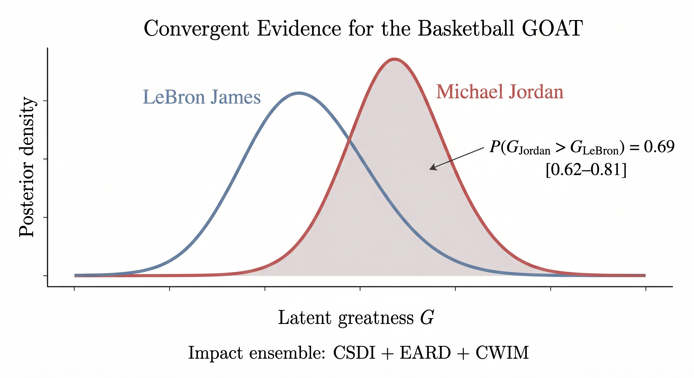

# Basketball GOAT: A Multi-Method Ensemble Analysis

**Convergent Evidence for the Greatest Basketball Player of All Time**

*Samuel Meyer, March 2026*

**[Read the full paper (PDF)](Basketball_GOAT_Multi-Method_Ensemble_Analysis.pdf)**

## Overview

Three performance-impact frameworks (CSDI, EARD, CWIM) form the core ensemble. Two preference-modeling frameworks (BPLS, AHP-SD) are reported separately as a consistency check. A latent variable model treats each impact framework as a noisy correlated measurement of an underlying "greatness" variable.

| Framework | Type | What it estimates |
|---|---|---|
| CSDI | Impact (core) | Composite statistical performance |
| EARD | Impact (core) | Era-adjusted relative dominance |
| CWIM | Impact (core) | Structured win-impact estimation |
| BPLS | Preference (check) | Expert-revealed career valuation |
| AHP-SD | Preference (check) | Multi-stakeholder criterion weighting |

## Key Result



> **P(G_Jordan > G_LeBron) = 0.69 [0.62--0.81]** (impact ensemble)

The preference check gives 0.83. Both favor Jordan but for different reasons: the impact ensemble measures on-court contribution; the preference ensemble reflects expert rankings that weight peak over longevity by 1.4:1.

**Ablation studies identify the structural hinge:** Jordan's advantage survives removal of BPM-family inputs and championship credit, but not removal of postseason emphasis. On regular-season data alone, LeBron leads 114.5 to 71.2 WAR. Playoff amplification is the single load-bearing assumption.

| Framework | Result | Confidence |
|---|---|---|
| CSDI | LeBron leads (3.42 vs 3.18) | LeBron leads 3/5 weighting schemes |
| EARD | Michael Jordan (9.72) | Rank 1 in 87%+ of bootstrap specs |
| CWIM | Michael Jordan (243.7 WAR) | Leads 9/10 sensitivity specs |
| BPLS (check) | Michael Jordan | P(Jordan) = 0.48; P(LeBron) = 0.31 |
| AHP-SD (check) | Michael Jordan (7 criteria) | 96.2% of 500K weight draws |

LeBron is the only serious alternative (31% posterior mass in the impact ensemble). The disagreement is about how one values playmaking and career longevity versus peak performance and postseason amplification.

## Reproducing the Analysis

```bash
pip install numpy scipy
python analysis/run_all.py
```

Runs all 8 steps: 5 frameworks + latent ensemble + ablation studies + sensitivity analyses. Saves JSON results to `results/`. Completes in ~3 seconds.

## Repository Structure

```
basketball-goat-analysis/
├── README.md
├── requirements.txt
├── Basketball_GOAT_Multi-Method_Ensemble_Analysis.pdf
├── basketball-goat-paper-draft.md
├── data/
│   ├── player_careers.py          # Career stats (10 primary + 15 additional)
│   ├── player_careers_part1-5.py  # Player data modules
│   └── rankings.py               # 14 published all-time expert rankings
├── frameworks/
│   ├── csdi.py                    # 6 sub-indices incl. playmaking + BPM-free ablation
│   ├── eard.py                    # Era-adjusted dominance + 10K bootstrap
│   ├── cwim.py                    # Structured win-impact + playoff-free ablation
│   ├── bpls.py                    # Bayesian career arcs + revealed-preference weights
│   └── ahp_sd.py                  # 7 criteria, 6 archetypes + championship-free ablation
├── analysis/
│   ├── run_all.py                 # Main pipeline (8 steps)
│   ├── ensemble.py                # Cross-framework aggregation
│   ├── latent_ensemble.py         # Latent variable model + sub-ensembles
│   └── ablations.py               # BPM-free, playoff-free, championship-free
└── results/                       # Output JSON files
```

## Paper Structure

The paper separates impact estimation from preference modeling and leads with ablation results:

- **Section 1.3**: What are we measuring? (impact vs preference distinction)
- **Section 3.6**: Latent variable ensemble with core/check split
- **Section 4.2**: Impact ensemble headline (P=0.69), preference check (0.83)
- **Section 5.1**: Convergence — what it does and doesn't prove
- **Section 5.5**: Playmaking effect — adding it narrowed the gap
- **Section 5.10**: Shared dependencies — effective independence 1.4-2.3
- **Section 5.12**: Ablation results — the structural hinge is playoff amplification
- **Section 6**: Conclusion — "The disagreement is about values, not about basketball."

## Peer Review & Revisions

Six rounds of review (4 initial peer reviewers + 2 rounds of methodological feedback). Key changes:

- Replaced incoherent "agreement index" with latent variable ensemble model
- Split ensemble into impact-only (core) and preference-only (check)
- Renamed CWIM from "Causal" to "Career" Win Impact Model; softened identification claims
- AHP-SD demoted from core ensemble to consistency check
- Added playmaking/versatility dimension (CSDI Z_play, AHP-SD C7)
- Added 3 ablation studies identifying playoff amplification as load-bearing assumption
- Reconciled effective-independence estimates (1.4 latent vs 2.3 eigenvalue)
- Multiple writing passes for prose quality and self-critique

## License

MIT License. For research and entertainment purposes.

## Citation

```
Meyer, S. (2026). Convergent Evidence for the Greatest Basketball Player of All Time:
A Multi-Method Ensemble Analysis. https://github.com/swmeyer1979/basketball-goat-analysis
```
